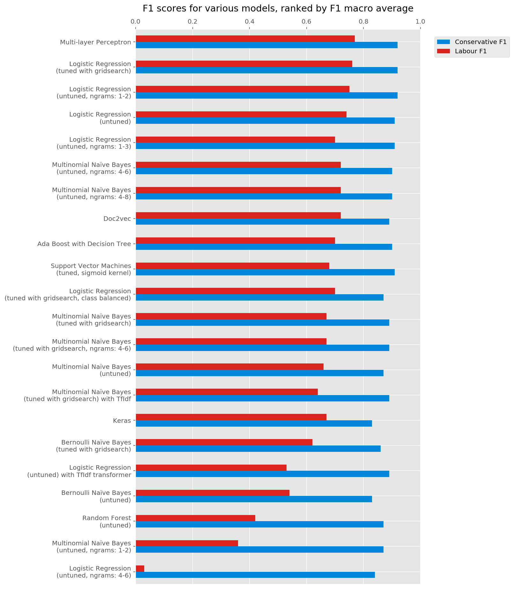
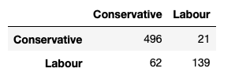
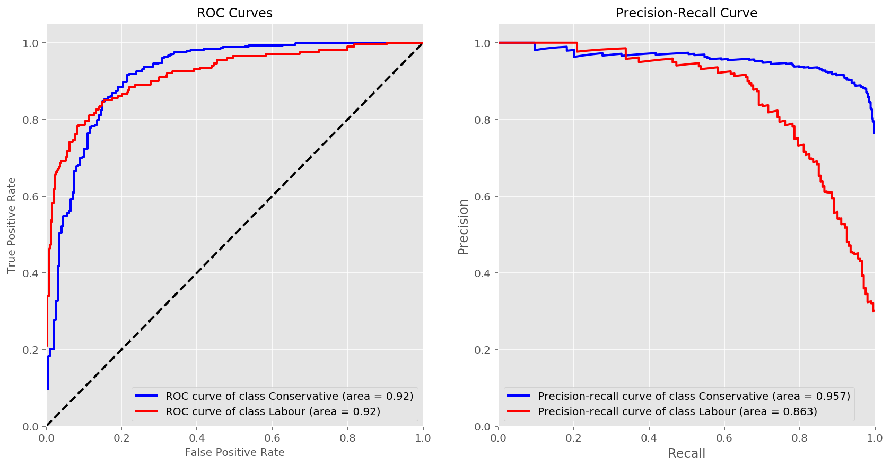

# capstone-uk-pol
## General Aseembly DSI7 Capstone Project - NLP analysis of UK political speeches

The aim of this project was to build a predictive model that would guess an MP's party based on the text of a speech, without any obvous indicators like party names or party leader names.

I also looked at the vocabularies of speakers from different parties, and carried out topic analysis on the speeches.

My dataset was scraped from the <a href='http://www.ukpol.co.uk'>UKPOL Political Speech Archive</a>.

Trying out various models I got the following F1 scores, ranked by macro F1 average:

The Multi-Layer Perceptron had the best results and gave the following confusion matrix for the test set (columns are predicted, rows are actual):

ROC and Precision-Recall curves:

Here is the <a href='https://tobyjdore.github.io/ukpol/project'>project report</a>, and I also kept a <a href='https://mydsblog.home.blog'>wordpress blog</a> of the process.

### Repository Contents:

#### Capstone-summary
- Executive summary of project, results, working code.

#### Data (folder)
- CSV files of project data from initial scrape through stages of cleaning

#### web-app (folder)
- flask code, web templates, and pickled model for the <a href='http://tobyjdore.pythonanywhere.com'>deployed classification model</a>.
